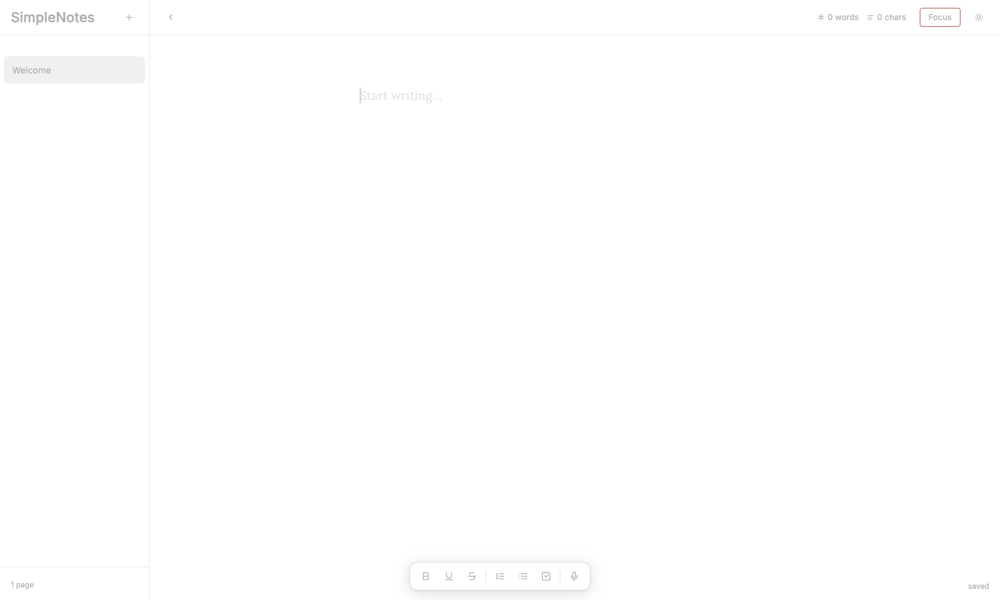

<div align="center">

# SimpleNotes

SimpleNotes is a simple lightweight place for taking notes, writing your thoughts, and more. No accounts, no distractions, and no unnecessary features, just a clean place to write and stay focused.

</div>

<div align="center">



</div>

---

## Features

- Create unlimited note projects
- Rename and delete projects
- Pin important projects to the top
- Live word counter
- Simple design
- And much more!

---
## Running the App

### 1. Clone the repository

```bash
git clone https://github.com/ZamanZahid/SimpleNote.git
cd SimpleNote
```

### 2. Install dependencies

```bash
npm install
```

### 3. Run the app

#### Development Mode (recommended while coding)

```bash
npm run dev
```

Open the URL shown in the terminal (usually `http://localhost:5173`).

#### Production Preview

```bash
npm run build
npx serve dist
```

Then open the URL it prints (usually `http://localhost:3000`).

---

## Data Storage

All notes are stored locally in your browser using Local Storage.

This means:

- Notes remain after refreshing
- No internet connection is required
- Data stays on your device
- Clearing browser data will remove saved notes

---

## Future Plans

- Search notes
- Export/Download notes
- Cloud sync

---


## Why I Created SimpleNotes


I created SimpleNotes because I couldn't find a note taking app that was simple, free, and saved my work without requiring an account. Most apps were either overloaded with features, included AI for no reason, required subscriptions, or made users to sign up before they could start writing.

SimpleNotes was built to solve that problem by giving a fast, distraction-free writing environment that works immediately and keeps your notes saved locally on your device, while still being some what customizable.
